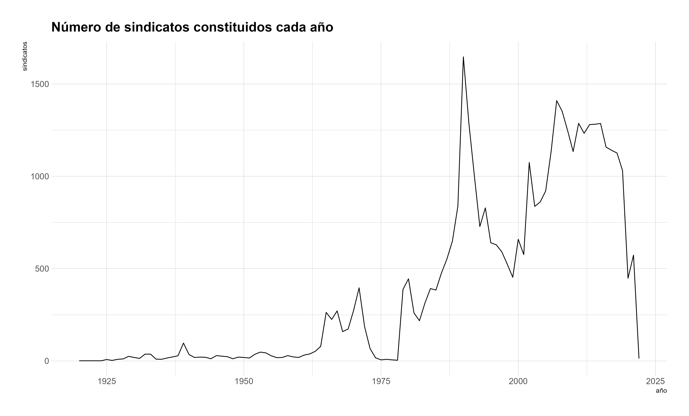
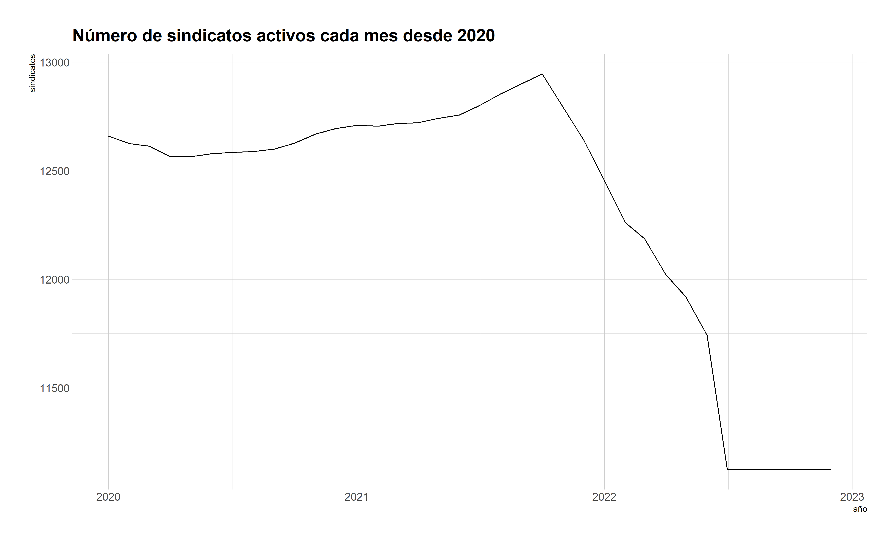

# sindicatoscl 

Paquete R para acceder a microdato de sindicatos activos y en receso en
Chile, proveniente de registro administrativo de la Dirección del
Trabajo.

# Instalar y cargar paquete

El paquete no se encuentra en la CRAN ni ha sido enviado, por lo que
debe instalarse la versión en desarrollo desde GitHub.

``` r
install.packages("devtools")
devtools::install_github("nicolasrattor/sindicatoscl")
```

``` r
library(sindicatoscl)
```

Además, se cargan otros paquetes para la manipulación de datos:

``` r
library(dplyr)
library(ggplot2)
library(hrbrthemes)
```

# Uso del paquete

## Obtener microdatos de sindicatos

El objetivo principal del paquete es disponer de una *dataframe* con el
listado de todos los sindicatos activos y en receso en Chile y, sus
principales características.

El *dataframe* `sindicatos` contiene 39439 observaciones para 15
variables:

<table>
<thead>
<tr>
<th style="text-align:left;">
variables
</th>
<th style="text-align:left;">
descripción
</th>
</tr>
</thead>
<tbody>
<tr>
<td style="text-align:left;width: 10cm; ">
region
</td>
<td style="text-align:left;width: 10cm; ">
Región de la dirección a la que se asocia el sindicato. Suele ser la de
la casa matriz de la empresa (16 regiones)
</td>
</tr>
<tr>
<td style="text-align:left;width: 10cm; ">
rsu\_raf
</td>
<td style="text-align:left;width: 10cm; ">
Identificador del sindicato
</td>
</tr>
<tr>
<td style="text-align:left;width: 10cm; ">
nombre
</td>
<td style="text-align:left;width: 10cm; ">
Nombre del sindicato
</td>
</tr>
<tr>
<td style="text-align:left;width: 10cm; ">
estado
</td>
<td style="text-align:left;width: 10cm; ">
Estado del sindicato: ACTIVO, RECESO, DISUELTO, CADUCADO O ELIMINADO
</td>
</tr>
<tr>
<td style="text-align:left;width: 10cm; ">
tipo
</td>
<td style="text-align:left;width: 10cm; ">
Tipo de sindicato: EMPRESA, ESTABLECIMIENTO, INDEPENDIENTE, INTER
EMPRESA o TRANSITORIO
</td>
</tr>
<tr>
<td style="text-align:left;width: 10cm; ">
direccion
</td>
<td style="text-align:left;width: 10cm; ">
Dirección a la que se asocia el sindicato. Suele ser la de la casa
matriz de la empresa
</td>
</tr>
<tr>
<td style="text-align:left;width: 10cm; ">
socios
</td>
<td style="text-align:left;width: 10cm; ">
Número de socios de sindicato registrados en último trámite
</td>
</tr>
<tr>
<td style="text-align:left;width: 10cm; ">
socias
</td>
<td style="text-align:left;width: 10cm; ">
Número de socias de sindicato registrados en último trámite
</td>
</tr>
<tr>
<td style="text-align:left;width: 10cm; ">
fecha\_constitucion
</td>
<td style="text-align:left;width: 10cm; ">
Fecha de constitución del sindicato
</td>
</tr>
<tr>
<td style="text-align:left;width: 10cm; ">
fecha\_ultima\_directiva
</td>
<td style="text-align:left;width: 10cm; ">
Fecha de elección de directiva. Se usa como proxy de último trámite
</td>
</tr>
<tr>
<td style="text-align:left;width: 10cm; ">
nombre\_oficina
</td>
<td style="text-align:left;width: 10cm; ">
Nombre oficina de Inspección del Trabajo en que se hizo la constitución
del sindicato
</td>
</tr>
<tr>
<td style="text-align:left;width: 10cm; ">
empresa
</td>
<td style="text-align:left;width: 10cm; ">
Nombre de la empresa
</td>
</tr>
<tr>
<td style="text-align:left;width: 10cm; ">
rut\_empresa
</td>
<td style="text-align:left;width: 10cm; ">
Rut de la empresa o de todas las empresas en las que existe el sindicato
(caso interempresas)
</td>
</tr>
<tr>
<td style="text-align:left;width: 10cm; ">
cae
</td>
<td style="text-align:left;width: 10cm; ">
Clasificador de Actividad Económica de la empresa
</td>
</tr>
<tr>
<td style="text-align:left;width: 10cm; ">
total\_socis
</td>
<td style="text-align:left;width: 10cm; ">
Número de socios y socias de sindicato registrados en último trámite
</td>
</tr>
</tbody>
</table>

Acá las primeras 5 filas y columnas de `sindicatos`

``` r
sindicatos
```

<table>
<thead>
<tr>
<th style="text-align:right;">
region
</th>
<th style="text-align:right;">
rsu\_raf
</th>
<th style="text-align:left;">
nombre
</th>
<th style="text-align:left;">
estado
</th>
</tr>
</thead>
<tbody>
<tr>
<td style="text-align:right;">
9
</td>
<td style="text-align:right;">
9040014
</td>
<td style="text-align:left;">
SINDICATO DE TRABAJADORES DE LA EMPRESA DE SERVICIOS GENESIS
</td>
<td style="text-align:left;">
RECESO
</td>
</tr>
<tr>
<td style="text-align:right;">
8
</td>
<td style="text-align:right;">
8010556
</td>
<td style="text-align:left;">
SINDICATO EMPRESA " GASTON A. SALDIAS RETAMAL"
</td>
<td style="text-align:left;">
RECESO
</td>
</tr>
<tr>
<td style="text-align:right;">
13
</td>
<td style="text-align:right;">
13014833
</td>
<td style="text-align:left;">
SINDICATO INTEREMPRESA NACIONAL DE TRABAJADORES SUBCONTRATADOS DE
SERVICIOS Y ACTIVIDADES ANEXOS
</td>
<td style="text-align:left;">
ACTIVO
</td>
</tr>
<tr>
<td style="text-align:right;">
13
</td>
<td style="text-align:right;">
13014733
</td>
<td style="text-align:left;">
SINDICATO Nº1 DE EMPRESA HGR
</td>
<td style="text-align:left;">
RECESO
</td>
</tr>
<tr>
<td style="text-align:right;">
13
</td>
<td style="text-align:right;">
13110102
</td>
<td style="text-align:left;">
SINDICATO N° 3 INTEREMPRESA DE TRABAJADORES DE LAS INDUSTRIAS DEL PAN Y
DE LA ALIMENTACIÓN.
</td>
<td style="text-align:left;">
ACTIVO
</td>
</tr>
<tr>
<td style="text-align:right;">
10
</td>
<td style="text-align:right;">
10010761
</td>
<td style="text-align:left;">
SINDICATO DE EMPRESA “SEGURIDAD KAPPES”
</td>
<td style="text-align:left;">
ACTIVO
</td>
</tr>
</tbody>
</table>

## Pasar la data al nivel empresa

En vez de colocar el foco en los sindicatos, puede ser de interés
centrarse en las empresas con sindicatos y sus características. Para
eso, hay que crear un nuevo conjunto de datos con la función
`empresas_sindicatos_activos()`, la que mantiene solo a los sindicatos
activos y del nivel empresa o establecimiento, y agrupa los datos por
empresa.

``` r
empresas <- empresas_sindicatos_activos()
```

El número de observaciones de la data resultante es igual al número de
empresas con sindicatos activos en Chile (4781). La nueva data además
agrega el número de sindicatos existentes en cada empresa, el total de
afiliados y el tamaño promedio de los sindicatos en cada empresa. El rut
de la empresa es el rut real, por lo que la información puede vincularse
a otras fuentes de datos de empresas.

<table>
<thead>
<tr>
<th style="text-align:left;">
rut\_empresa
</th>
<th style="text-align:right;">
sindicatos
</th>
<th style="text-align:right;">
afiliads
</th>
<th style="text-align:right;">
tamano\_promedio
</th>
</tr>
</thead>
<tbody>
<tr>
<td style="text-align:left;">
81537600
</td>
<td style="text-align:right;">
72
</td>
<td style="text-align:right;">
9755
</td>
<td style="text-align:right;">
135.48611
</td>
</tr>
<tr>
<td style="text-align:left;">
76134941
</td>
<td style="text-align:right;">
48
</td>
<td style="text-align:right;">
9229
</td>
<td style="text-align:right;">
192.27083
</td>
</tr>
<tr>
<td style="text-align:left;">
17005635
</td>
<td style="text-align:right;">
46
</td>
<td style="text-align:right;">
6462
</td>
<td style="text-align:right;">
140.47826
</td>
</tr>
<tr>
<td style="text-align:left;">
76879810
</td>
<td style="text-align:right;">
35
</td>
<td style="text-align:right;">
4480
</td>
<td style="text-align:right;">
128.00000
</td>
</tr>
<tr>
<td style="text-align:left;">
61704000
</td>
<td style="text-align:right;">
30
</td>
<td style="text-align:right;">
13770
</td>
<td style="text-align:right;">
459.00000
</td>
</tr>
<tr>
<td style="text-align:left;">
83150900
</td>
<td style="text-align:right;">
26
</td>
<td style="text-align:right;">
836
</td>
<td style="text-align:right;">
32.15385
</td>
</tr>
</tbody>
</table>

Con estos datos se puede construir un indicador simple de *fragmentación
sindical*: en promedio existen 1,53 sindicatos por empresa y en más del
75% de las empresas con sindicato solamente existe un sindicato.

``` r
summary(empresas$sindicatos)
```

    ##    Min. 1st Qu.  Median    Mean 3rd Qu.    Max. 
    ##   1.000   1.000   1.000   1.534   1.000  72.000

Este indicador se puede obtener para cada sector económico utilizando
los datos del Servicio de Impuestos Internos (ver viñeta
[SII](https://nicolasrattor.github.io/sindicatoscl/articles/sii.html))

## Serie histórica sindicatos constituidos

``` r
serie <- constitucion_anual()
plot(serie$ano,serie$sindicatos,type = "l")

serie %>% 
  ggplot(aes(ano, sindicatos)) + 
  geom_line() +
  labs(x = "año", y = "sindicatos",
       title = "Número de sindicatos constituidos cada año") +
  theme_ipsum()
```



## Serie histórica activos

``` r
serie <- activos_historico(desde=2020,hasta=2021)
serie$fecha <- lubridate::make_date(year=serie$ano,month=serie$mes)
plot(serie$fecha,serie$sindicatos,type = "l")

serie %>% 
  ggplot(aes(fecha, sindicatos)) + 
  geom_line() +
  labs(x = "año", y = "sindicatos",
       title = "Número de sindicatos activos cada mes desde 2020") +
  theme_ipsum()
```



## Consultar sindicatos activos por fecha

``` r
nrow(activos_en(ano=1990,mes=1))
```

    ## [1] 2814

``` r
head(activos_en(ano=1990,mes=1)[,c(1:4)])
```

    ## # A tibble: 6 x 4
    ##   region  rsu_raf nombre                                                 estado 
    ##    <dbl>    <dbl> <chr>                                                  <chr>  
    ## 1     13 13110102 SINDICATO N° 3 INTEREMPRESA DE TRABAJADORES DE LAS IN~ ACTIVO 
    ## 2      6  6020004 SINDICATO INTEREMPRESA DE TRABAJADORES DE LAS INDUSTR~ ACTIVO 
    ## 3     13 13110159 SINDICATO DE EMPRESA PEDRO PABLO CASTILLO C.,          RECESO 
    ## 4     10 10030025 SINDICATO DE TRABAJADORES ALAMOS DE LA EMPRESA ENRIQU~ DISUEL~
    ## 5     14 14010036 SINDICATO DE TRABAJADORES DE EMPRESA ANDRES FRIED KOO~ RECESO 
    ## 6      7  7060008 SINDICATO INTEREMPRESA DE TRABAJADORES DE las industr~ ACTIVO

## Consultar por nombre sindicato o empresa

``` r
buscar_sindicatos(empresa_buscada="walmart",sindicato_buscado="lider")[,c(2,3)]
```

    ## # A tibble: 32 x 2
    ##     rsu_raf nombre                                                              
    ##       <dbl> <chr>                                                               
    ##  1  5010677 "sindicato de empresa hipermercado valparaiso ltda. \" lider valpar~
    ##  2 15010407 "sindicato nº1 de empresa supermercado lider de arica"              
    ##  3 14010513 "sindicato de empresa lider valdivia"                               
    ##  4  8050451 "sindicato nº 2 lider bio bio- sl2bb"                               
    ##  5 14010540 "sindicato nº 3 empresa lider valdivia"                             
    ##  6 13090925 "sindicato de empresa lider supermercado maipu ltda"                
    ##  7 13130990 "sindicato empresa lider velasquez oeste"                           
    ##  8 13090970 "sindicato unificado lider lonquen ltda."                           
    ##  9 12010284 "sindicato hiper lider punta arenas"                                
    ## 10  5011066 "sindicato interempresa de trabajadores de supermercados lider, val~
    ## # ... with 22 more rows

``` r
buscar_sindicatos(empresa_buscada="codelco",sindicato_buscado="")[,c(2,3)]
```

    ## # A tibble: 52 x 2
    ##    rsu_raf nombre                                                               
    ##      <dbl> <chr>                                                                
    ##  1 6010813 "sindicato interempresa \"sintrauni\""                               
    ##  2 6010918 "sindicato nacional de trabajadores de mantención, minería, montajes~
    ##  3 6010025 "sindicato de trabajadores sewell y mina nº8, de la empresa codelco ~
    ##  4 6010026 "sindicato profesional sewell y mina"                                
    ##  5 2020002 "sindicato de trabajadores nº 1 chuquicamata, codelco chile"         
    ##  6 2020009 "sindicato de trabajadores nº 2 de la division chuquicamata de codel~
    ##  7 2020036 "sindicato de trabajadores nº 3 de empresa codelco-chile, division c~
    ##  8 2020041 "sindicato de trabajadores supervisores rol-a de la empresa codelco ~
    ##  9 2020053 "sindicato de trabajadores de empresa nº 5, de codelco chile"        
    ## 10 2020125 "sindicato de trabajadores radomiro tomic de la division codelco nor~
    ## # ... with 42 more rows

``` r
buscar_sindicatos(empresa_buscada="",sindicato_buscado="casa particular")[,c(2,3)]
```

    ## # A tibble: 2 x 2
    ##    rsu_raf nombre                                                               
    ##      <dbl> <chr>                                                                
    ## 1 12010227 sindicato interempresa de trabajadoras y trabajadores de casa partic~
    ## 2 13014061 sindicato nacional interempresa de trabajadores inmigrantes de casa ~

# Sobre los datos usados

Registros administrativos de acceso público de la Dirección del Trabajo.
Disponibles para descarga en:
<https://tramites.dirtrab.cl/VentanillaTransparencia/Transparencia/RerporteRRLLOrg.aspx>.
Los datos utilizados en el paquete fueron descargados el 16 de enero de
2022.

# Uso de los datos

Los Registros administrativos de la Dirección del Trabajo los hemos
utilizado en el [Repositorio de Estadísticas
Sindicales](https://repositoriosindical.netlify.app/), para la
elaboración de la [**Minuta N°1** Sindicatos en la coyuntura del
estallido social y la pandemia
(2018-2021)](https://github.com/nicolasrattor/Ventanilla_Sindicatos_DT/raw/main/Minuta1/Minuta1.pdf).
