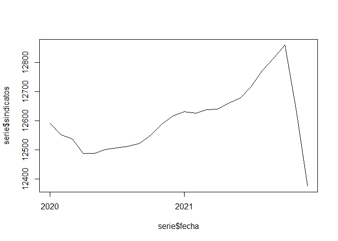

# sindicatoscl 

Paquete R para acceder a registro administrativo de sindicatos activos y
en receso en Chile (1920-2021)

# Instalar y cargar paquete

``` r
install.packages("devtools")
devtools::install_github("nicolasrattor/sindicatoscl")
```

``` r
library(sindicatoscl)
library(dplyr)
```

# Uso del paquete

## Obtener el registro en bruto

``` r
sindicatos
```

    ## [1] 39449    15

| region | rsu\_raf | nombre                                                                                           | estado |
|-------:|---------:|:-------------------------------------------------------------------------------------------------|:-------|
|      9 |  9040014 | SINDICATO DE TRABAJADORES DE LA EMPRESA DE SERVICIOS GENESIS                                     | RECESO |
|      8 |  8010556 | SINDICATO EMPRESA " GASTON A. SALDIAS RETAMAL"                                                   | RECESO |
|     13 | 13014833 | SINDICATO INTEREMPRESA NACIONAL DE TRABAJADORES SUBCONTRATADOS DE SERVICIOS Y ACTIVIDADES ANEXOS | ACTIVO |
|     13 | 13014733 | SINDICATO Nº1 DE EMPRESA HGR                                                                     | RECESO |
|     13 | 13110102 | SINDICATO N° 3 INTEREMPRESA DE TRABAJADORES DE LAS INDUSTRIAS DEL PAN Y DE LA ALIMENTACIÓN.      | ACTIVO |
|     10 | 10010761 | SINDICATO DE EMPRESA “SEGURIDAD KAPPES”                                                          | ACTIVO |

    ##  [1] "tipo"                   "direccion"              "socios"                 "socias"                
    ##  [5] "fecha_constitucion"     "fecha_ultima_directiva" "nombre_oficina"         "empresa"               
    ##  [9] "rut_empresa"            "cae"                    "total_socis"

## Agrupar por empresa

``` r
empresas_sindicatos_activos()
```

    ## # A tibble: 6 x 4
    ##   rut_empresa sindicatos afiliads tamano_promedio
    ##   <chr>            <int>    <dbl>           <dbl>
    ## 1 81537600            72     9755           135. 
    ## 2 76134941            48     9229           192. 
    ## 3 17005635            46     6462           140. 
    ## 4 76879810            35     4480           128  
    ## 5 61704000            30    13770           459  
    ## 6 83150900            26      836            32.2

## Indicador de fragmentación sindical

``` r
empresas <- empresas_sindicatos_activos()
summary(empresas$sindicatos)
```

    ##    Min. 1st Qu.  Median    Mean 3rd Qu.    Max. 
    ##   1.000   1.000   1.000   1.534   1.000  72.000

``` r
sectores <- sii_agregar() %>% group_by(rut_empresa) %>% summarise(rubro_sii=first(rubro_sii))
empresas <- merge(empresas,sectores,by="rut_empresa",all.x = TRUE)
empresas %>% group_by(rubro_sii) %>% summarise(fragmentacion=mean(sindicatos),
                                               n=n()) %>% 
  arrange(-fragmentacion)
```

    ## # A tibble: 25 x 3
    ##    rubro_sii                                                                          fragmentacion     n
    ##    <fct>                                                                                      <dbl> <int>
    ##  1 ADMINISTRACION PUBLICA Y DEFENSA; PLANES DE SEGURIDAD SOCIAL DE AFILIACION OBLIG            2.8      5
    ##  2 EXPLOTACION DE MINAS Y CANTERAS                                                             2.12   110
    ##  3 SUMINISTRO DE AGUA; EVACUACION DE AGUAS RESIDUALES, GESTION DE DESECHOS Y DESCON            2.08    36
    ##  4 SUMINISTRO DE AGUA; EVACUACION DE AGUAS RESIDUALES, GESTION DE DESECHOS Y DESCONT~          1.81    27
    ##  5 SUMINISTRO DE ELECTRICIDAD, GAS, VAPOR Y AIRE ACONDICIONADO                                 1.69    62
    ##  6 COMERCIO AL POR MAYOR Y AL POR MENOR; REPARACION DE VEHICULOS AUTOMOTORES Y MOTO            1.68   259
    ##  7 TRANSPORTE Y ALMACENAMIENTO                                                                 1.68   426
    ##  8 ACTIVIDADES DE SERVICIOS ADMINISTRATIVOS Y DE APOYO                                         1.62   413
    ##  9 INDUSTRIA MANUFACTURERA                                                                     1.61   856
    ## 10 ACTIVIDADES DE ALOJAMIENTO Y DE SERVICIO DE COMIDAS                                         1.55   131
    ## # ... with 15 more rows

## Serie histórica sindicatos constituidos

``` r
serie <- constitucion_anual()
plot(serie$ano,serie$sindicatos,type = "l")
```

<!-- -->

## Serie histórica activos

``` r
serie <- activos_historico(desde=2020,hasta=2021)
serie$fecha <- lubridate::make_date(year=serie$ano,month=serie$mes)
plot(serie$fecha,serie$sindicatos,type = "l")
```

<!-- -->

## Consultar sindicatos activos por fecha

``` r
nrow(activos_en(ano=1990,mes=1))
```

    ## [1] 2816

``` r
head(activos_en(ano=1990,mes=1)[,c(1:4)])
```

    ## # A tibble: 6 x 4
    ##   region  rsu_raf nombre                                                                          estado 
    ##    <dbl>    <dbl> <chr>                                                                           <chr>  
    ## 1     13 13110102 SINDICATO N° 3 INTEREMPRESA DE TRABAJADORES DE LAS INDUSTRIAS DEL PAN Y DE LA ~ ACTIVO 
    ## 2      6  6020004 SINDICATO INTEREMPRESA DE TRABAJADORES DE LAS INDUSTRIAS PANIFICADORAS DE LA P~ ACTIVO 
    ## 3     13 13110159 SINDICATO DE EMPRESA PEDRO PABLO CASTILLO C.,                                   RECESO 
    ## 4     10 10030025 SINDICATO DE TRABAJADORES ALAMOS DE LA EMPRESA ENRIQUE GUNTHER HEUSER DE OSORNO DISUEL~
    ## 5     14 14010036 SINDICATO DE TRABAJADORES DE EMPRESA ANDRES FRIED KOOP,EXPLOTACION AGRICOLA, M~ RECESO 
    ## 6      7  7060008 SINDICATO INTEREMPRESA DE TRABAJADORES DE las industrias del pan y de la alime~ ACTIVO

## Consultar por nombre sindicato o empresa

``` r
buscar_sindicatos(empresa_buscada="walmart",sindicato_buscado="lider")[,c(2,3)]
```

    ## # A tibble: 32 x 2
    ##     rsu_raf nombre                                                                     
    ##       <dbl> <chr>                                                                      
    ##  1  5010677 "sindicato de empresa hipermercado valparaiso ltda. \" lider valparaiso \""
    ##  2 15010407 "sindicato nº1 de empresa supermercado lider de arica"                     
    ##  3 14010513 "sindicato de empresa lider valdivia"                                      
    ##  4  8050451 "sindicato nº 2 lider bio bio- sl2bb"                                      
    ##  5 14010540 "sindicato nº 3 empresa lider valdivia"                                    
    ##  6 13090925 "sindicato de empresa lider supermercado maipu ltda"                       
    ##  7 13130990 "sindicato empresa lider velasquez oeste"                                  
    ##  8 13090970 "sindicato unificado lider lonquen ltda."                                  
    ##  9 12010284 "sindicato hiper lider punta arenas"                                       
    ## 10  5011066 "sindicato interempresa de trabajadores de supermercados lider, valparaiso"
    ## # ... with 22 more rows

``` r
buscar_sindicatos(empresa_buscada="codelco",sindicato_buscado="")[,c(2,3)]
```

    ## # A tibble: 52 x 2
    ##    rsu_raf nombre                                                                                        
    ##      <dbl> <chr>                                                                                         
    ##  1 6010813 "sindicato interempresa \"sintrauni\""                                                        
    ##  2 6010918 "sindicato nacional de trabajadores de mantención, minería, montajes, agricolas y afines"     
    ##  3 6010025 "sindicato de trabajadores sewell y mina nº8, de la empresa codelco chile division el tenient~
    ##  4 6010026 "sindicato profesional sewell y mina"                                                         
    ##  5 2020002 "sindicato de trabajadores nº 1 chuquicamata, codelco chile"                                  
    ##  6 2020009 "sindicato de trabajadores nº 2 de la division chuquicamata de codelco chile, centro de traba~
    ##  7 2020036 "sindicato de trabajadores nº 3 de empresa codelco-chile, division codelco norte, centro de t~
    ##  8 2020041 "sindicato de trabajadores supervisores rol-a de la empresa codelco chile division codelco no~
    ##  9 2020053 "sindicato de trabajadores de empresa nº 5, de codelco chile"                                 
    ## 10 2020125 "sindicato de trabajadores radomiro tomic de la division codelco norte, codelco chile"        
    ## # ... with 42 more rows

``` r
buscar_sindicatos(empresa_buscada="",sindicato_buscado="casa particular")[,c(2,3)]
```

    ## # A tibble: 2 x 2
    ##    rsu_raf nombre                                                                                        
    ##      <dbl> <chr>                                                                                         
    ## 1 12010227 sindicato interempresa de trabajadoras y trabajadores de casa particular de la region de maga~
    ## 2 13014061 sindicato nacional interempresa de trabajadores inmigrantes de casa particular

## Obtener solo a los sindicatos activos (en 2021)

``` r
sindicatos_activos()
```

    ## [1] 11738    12

| region | rsu\_raf | nombre                                                                                           | tipo                    |
|-------:|---------:|:-------------------------------------------------------------------------------------------------|:------------------------|
|     13 | 13014833 | SINDICATO INTEREMPRESA NACIONAL DE TRABAJADORES SUBCONTRATADOS DE SERVICIOS Y ACTIVIDADES ANEXOS | SINDICATO INTER EMPRESA |
|     13 | 13110102 | SINDICATO N° 3 INTEREMPRESA DE TRABAJADORES DE LAS INDUSTRIAS DEL PAN Y DE LA ALIMENTACIÓN.      | SINDICATO INTER EMPRESA |
|     10 | 10010761 | SINDICATO DE EMPRESA “SEGURIDAD KAPPES”                                                          | SINDICATO EMPRESA       |
|      5 |  5060883 | SINDICATO DE TRABAJADORES DE C & F MULTISERVICES                                                 | SINDICATO EMPRESA       |
|      5 |  5010912 | SINDICATO INTEREMPRESA UNICO DE TRABAJADORES DE CHILE                                            | SINDICATO INTER EMPRESA |
|      5 |  5010916 | SINDICATO INTEREMPRESA NACIONAL UNICO DE TRABAJADORES DE CHILE                                   | SINDICATO INTER EMPRESA |

## Obtener solo a los sindicatos de empresa

``` r
sindicatos_empresas()
```

    ## [1] 25314    12

| region | rsu\_raf | nombre                                                                                          | estado |
|-------:|---------:|:------------------------------------------------------------------------------------------------|:-------|
|      9 |  9040014 | SINDICATO DE TRABAJADORES DE LA EMPRESA DE SERVICIOS GENESIS                                    | RECESO |
|      8 |  8010556 | SINDICATO EMPRESA " GASTON A. SALDIAS RETAMAL"                                                  | RECESO |
|     13 | 13014733 | SINDICATO Nº1 DE EMPRESA HGR                                                                    | RECESO |
|     10 | 10010761 | SINDICATO DE EMPRESA “SEGURIDAD KAPPES”                                                         | ACTIVO |
|     13 | 13130541 | SINDICATO DE TRABAJADORES DE EMPRESA FRANCISCO CASTRO ESTEVEZ DE SAN BERNARDO                   | RECESO |
|     13 | 13012886 | SINDICATO DE TRABAJADORES DEL ESTABLECIMIENTO DE RANCAGUA Nº 544 DE LA EMPRESA EULEN CHILE S.A. | RECESO |

## Obtener datos del Servicio de Impuestos Internos

``` r
datos <- sii_agregar()
knitr::kable(
  dplyr::mutate(
  as.data.frame(
    round(
      prop.table(
        table(datos$rubro_sii,useNA="ifany")),3)
    ),Freq=Freq*100
  )
)
```

| Var1                                                                                       | Freq |
|:-------------------------------------------------------------------------------------------|-----:|
|                                                                                            |  0.0 |
| ACTIVIDADES ARTISTICAS, DE ENTRETENIMIENTO Y RECREATIVAS                                   |  1.3 |
| ACTIVIDADES DE ALOJAMIENTO Y DE SERVICIO DE COMIDAS                                        |  2.7 |
| ACTIVIDADES DE ATENCION DE LA SALUD HUMANA Y DE ASISTENCIA SOCIAL                          |  2.9 |
| ACTIVIDADES DE LOS HOGARES COMO EMPLEADORES; ACTIVIDADES NO DIFERENCIADAS DE LOS HOGARES   |  0.0 |
| ACTIVIDADES DE ORGANIZACIONES Y ORGANOS EXTRATERRITORIALES                                 |  0.0 |
| ACTIVIDADES DE SERVICIOS ADMINISTRATIVOS Y DE APOYO                                        |  9.0 |
| ACTIVIDADES FINANCIERAS Y DE SEGUROS                                                       |  2.2 |
| ACTIVIDADES INMOBILIARIAS                                                                  |  1.2 |
| ACTIVIDADES PROFESIONALES, CIENTIFICAS Y TECNICAS                                          |  3.2 |
| ADMINISTRACION PUBLICA Y DEFENSA; PLANES DE SEGURIDAD SOCIAL DE AFILIACION OBLIGATORIA     |  0.0 |
| AGRICULTURA, GANADERIA, SILVICULTURA Y PESCA                                               |  4.5 |
| COMERCIO AL POR MAYOR Y AL POR MENOR; REPARACION DE VEHICULOS AUTOMOTORES Y MOTOCICLETAS   |  5.3 |
| CONSTRUCCION                                                                               |  3.3 |
| ENSEÑANZA                                                                                  | 12.7 |
| EXPLOTACION DE MINAS Y CANTERAS                                                            |  3.1 |
| INDUSTRIA MANUFACTURERA                                                                    | 18.6 |
| INFORMACION Y COMUNICACIONES                                                               |  2.0 |
| OTRAS ACTIVIDADES DE SERVICIOS                                                             |  5.0 |
| SUMINISTRO DE AGUA; EVACUACION DE AGUAS RESIDUALES, GESTION DE DESECHOS Y DESCONTAMINACION |  0.7 |
| SUMINISTRO DE ELECTRICIDAD, GAS, VAPOR Y AIRE ACONDICIONADO                                |  1.4 |
| TRANSPORTE Y ALMACENAMIENTO                                                                |  9.6 |
| Valor por Defecto                                                                          |  0.2 |
| COMERCIO AL POR MAYOR Y AL POR MENOR; REPARACION DE VEHICULOS AUTOMOTORES Y MOTO           |  5.9 |
| SUMINISTRO DE AGUA; EVACUACION DE AGUAS RESIDUALES, GESTION DE DESECHOS Y DESCON           |  1.0 |
| ADMINISTRACION PUBLICA Y DEFENSA; PLANES DE SEGURIDAD SOCIAL DE AFILIACION OBLIG           |  0.2 |
| ACTIVIDADES DE LOS HOGARES COMO EMPLEADORES; ACTIVIDADES NO DIFERENCIADAS DE LOS           |  0.0 |
| NA                                                                                         |  3.8 |

**Tasa de sindicalización**

Proporción de sindicatos con tasa de sindicalización válida

``` r
nrow(datos[datos$tasa_sindicalizacion<=1&!is.na(datos$tasa_sindicalizacion),])/nrow(datos)
```

    ## [1] 0.8993651

Resumen variable tasa de sindicalización

``` r
summary(datos[datos$tasa_sindicalizacion<=1,]$tasa_sindicalizacion)
```

    ##    Min. 1st Qu.  Median    Mean 3rd Qu.    Max.    NA's 
    ##  0.0000  0.0530  0.1631  0.2311  0.3595  1.0000     598

# Sobre los datos usados

Registros administrativos de acceso público de la Dirección del Trabajo.
Disponibles para descarga en:
<https://tramites.dirtrab.cl/VentanillaTransparencia/Transparencia/RerporteRRLLOrg.aspx>.
Los datos utilizados en el paquete fueron descargados el 2022-02-14 y
son actualizados el último día de cada mes.

# Uso de los datos

Los Registros administrativos de la Dirección del Trabajo los hemos
utilizado en el [Repositorio de Estadísticas
Sindicales](https://repositoriosindical.netlify.app/), para la
elaboración de la [**Minuta N°1** Sindicatos en la coyuntura del
estallido social y la pandemia
(2018-2021)](https://github.com/nicolasrattor/Ventanilla_Sindicatos_DT/raw/main/Minuta1/Minuta1.pdf).
