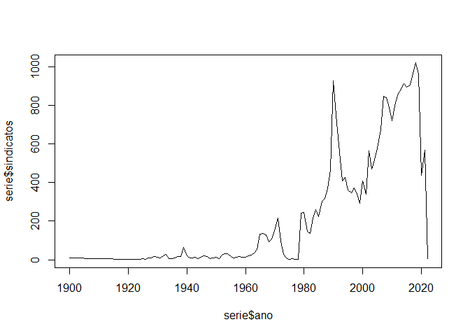
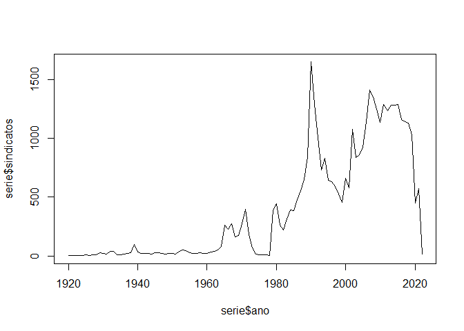

# sindicatoscl

Paquete R para acceder a registro administrativo de sindicatos activos y
en receso en Chile (1920-2021)

# Instalar y cargar paquete

``` r
install.packages("devtools")
devtools::install_github("nicolasrattor/sindicatoscl")
```

``` r
library(sindicatoscl)
```

# Uso del paquete

## Obtener el registro en bruto

``` r
sindicatos
```

    ## [1] 25457    15

| region | rsu\_raf | nombre                                                                                           | estado |
|-------:|---------:|:-------------------------------------------------------------------------------------------------|:-------|
|      8 |  8010556 | SINDICATO EMPRESA " GASTON A. SALDIAS RETAMAL"                                                   | RECESO |
|     13 | 13014833 | SINDICATO INTEREMPRESA NACIONAL DE TRABAJADORES SUBCONTRATADOS DE SERVICIOS Y ACTIVIDADES ANEXOS | ACTIVO |
|     13 | 13021500 | SINDICATO DE TRABAJADORES INDEPENDIENTES FERIA PERSA SAN RAMON                                   | ACTIVO |
|     13 | 13110102 | SINDICATO N° 3 INTEREMPRESA DE TRABAJADORES DE LAS INDUSTRIAS DEL PAN Y DE LA ALIMENTACIÓN.      | ACTIVO |
|     10 | 10010761 | SINDICATO DE EMPRESA “SEGURIDAD KAPPES”                                                          | ACTIVO |
|      5 |  5060883 | SINDICATO DE TRABAJADORES DE C & F MULTISERVICES                                                 | ACTIVO |

    ##  [1] "tipo"                   "direccion"              "socios"                
    ##  [4] "socias"                 "fecha_constitucion"     "fecha_ultima_directiva"
    ##  [7] "nombre_oficina"         "empresa"                "rut_empresa"           
    ## [10] "cae"                    "total_socis"

## Agrupar por empresa

``` r
empresas_sindicatos_activos()
```

    ## # A tibble: 6 x 4
    ##   rut_empresa sindicatos afiliads tamano_promedio
    ##   <chr>            <int>    <dbl>           <dbl>
    ## 1 81537600            73     9852           135. 
    ## 2 76134941            49     9345           191. 
    ## 3 17005635            46     6462           140. 
    ## 4 76879810            36     4627           129. 
    ## 5 61704000            31    13778           444. 
    ## 6 83150900            26      859            33.0

## Serie histórica sindicatos constituidos

``` r
serie <- constitucion_anual()
plot(serie$ano,serie$sindicatos,type = "l")
```

<!-- -->

## Serie histórica activos

``` r
serie <- activos_historico(desde=2020,hasta=2021)
serie$fecha <- lubridate::make_date(year=serie$ano,month=serie$mes)
plot(serie$fecha,serie$sindicatos,type = "l")
```

<!-- -->

## Consultar sindicatos activos por fecha

``` r
nrow(activos_en(ano=1990,mes=1))
```

    ## [1] 2047

``` r
head(activos_en(ano=1990,mes=1)[,c(1:4)])
```

    ## # A tibble: 6 x 4
    ##   region  rsu_raf nombre                                                  estado
    ##    <dbl>    <dbl> <chr>                                                   <chr> 
    ## 1     13 13110102 SINDICATO N° 3 INTEREMPRESA DE TRABAJADORES DE LAS IND~ ACTIVO
    ## 2     13 13050042 SINDICATO DE TRABAJADORES INDEPENDIENTES COMERCIANTES ~ ACTIVO
    ## 3      6  6020004 SINDICATO INTEREMPRESA DE TRABAJADORES DE LAS INDUSTRI~ ACTIVO
    ## 4      3  3010015 SINDICATO DE TRABAJADORES INDEPENDIENTES Nº 1 DE SUPLE~ ACTIVO
    ## 5     15 15010114 SINDICATO DE TRABAJADORES INDEPENDIENTES DUEÑOS DE TAX~ ACTIVO
    ## 6     16 16010050 SINDICATO DE TRABAJADORES INDEPENDIENTES EN VENTA DE H~ ACTIVO

## Consultar por nombre sindicato o empresa

``` r
buscar_sindicatos(empresa_buscada="walmart",sindicato_buscado="lider")[,c(2,3)]
```

    ## # A tibble: 30 x 2
    ##     rsu_raf nombre                                                              
    ##       <dbl> <chr>                                                               
    ##  1  5010677 "sindicato de empresa hipermercado valparaiso ltda. \" lider valpar~
    ##  2 15010407 "sindicato nº1 de empresa supermercado lider de arica"              
    ##  3 14010513 "sindicato de empresa lider valdivia"                               
    ##  4  8050451 "sindicato nº 2 lider bio bio- sl2bb"                               
    ##  5 14010540 "sindicato nº 3 empresa lider valdivia"                             
    ##  6 13090925 "sindicato de empresa lider supermercado maipu ltda"                
    ##  7 13130990 "sindicato empresa lider velasquez oeste"                           
    ##  8 13090970 "sindicato unificado lider lonquen ltda."                           
    ##  9 12010284 "sindicato hiper lider punta arenas"                                
    ## 10  5011066 "sindicato interempresa de trabajadores de supermercados lider, val~
    ## # ... with 20 more rows

``` r
buscar_sindicatos(empresa_buscada="codelco",sindicato_buscado="")[,c(2,3)]
```

    ## # A tibble: 51 x 2
    ##    rsu_raf nombre                                                               
    ##      <dbl> <chr>                                                                
    ##  1 6010813 "sindicato interempresa \"sintrauni\""                               
    ##  2 6010918 "sindicato nacional de trabajadores de mantención, minería, montajes~
    ##  3 6010025 "sindicato de trabajadores sewell y mina nº8, de la empresa codelco ~
    ##  4 6010026 "sindicato profesional sewell y mina"                                
    ##  5 2010067 "sindicato de trabajadores nº 1, codelco chile division codelco nort~
    ##  6 2020002 "sindicato de trabajadores nº 1 chuquicamata, codelco chile"         
    ##  7 2020009 "sindicato de trabajadores nº 2 de la division chuquicamata de codel~
    ##  8 2020036 "sindicato de trabajadores nº 3 de empresa codelco-chile, division c~
    ##  9 2020041 "sindicato de trabajadores supervisores rol-a de la empresa codelco ~
    ## 10 2020053 "sindicato de trabajadores de empresa nº 5, de codelco chile"        
    ## # ... with 41 more rows

``` r
buscar_sindicatos(empresa_buscada="",sindicato_buscado="casa particular")[,c(2,3)]
```

    ## # A tibble: 3 x 2
    ##    rsu_raf nombre                                                               
    ##      <dbl> <chr>                                                                
    ## 1 13014061 sindicato nacional interempresa de trabajadores inmigrantes de casa ~
    ## 2 13014070 sindicato nacional unitario interempresa de trabajadoras y de trabaj~
    ## 3  4010023 sindicato interempresa de trabajadoras de casa particular

## Obtener solo a los sindicatos activos (en 2021)

``` r
sindicatos_activos()
```

    ## [1] 11778    12

| region | rsu\_raf | nombre                                                                                           | tipo                    |
|-------:|---------:|:-------------------------------------------------------------------------------------------------|:------------------------|
|     13 | 13014833 | SINDICATO INTEREMPRESA NACIONAL DE TRABAJADORES SUBCONTRATADOS DE SERVICIOS Y ACTIVIDADES ANEXOS | SINDICATO INTER EMPRESA |
|     13 | 13021500 | SINDICATO DE TRABAJADORES INDEPENDIENTES FERIA PERSA SAN RAMON                                   | SINDICATO INDEPENDIENTE |
|     13 | 13110102 | SINDICATO N° 3 INTEREMPRESA DE TRABAJADORES DE LAS INDUSTRIAS DEL PAN Y DE LA ALIMENTACIÓN.      | SINDICATO INTER EMPRESA |
|     10 | 10010761 | SINDICATO DE EMPRESA “SEGURIDAD KAPPES”                                                          | SINDICATO EMPRESA       |
|      5 |  5060883 | SINDICATO DE TRABAJADORES DE C & F MULTISERVICES                                                 | SINDICATO EMPRESA       |
|      5 |  5010912 | SINDICATO INTEREMPRESA UNICO DE TRABAJADORES DE CHILE                                            | SINDICATO INTER EMPRESA |

## Obtener solo a los sindicatos de empresa

``` r
sindicatos_empresas()
```

    ## [1] 14863    12

| region | rsu\_raf | nombre                                                           | estado |
|-------:|---------:|:-----------------------------------------------------------------|:-------|
|      8 |  8010556 | SINDICATO EMPRESA " GASTON A. SALDIAS RETAMAL"                   | RECESO |
|     10 | 10010761 | SINDICATO DE EMPRESA “SEGURIDAD KAPPES”                          | ACTIVO |
|      5 |  5060883 | SINDICATO DE TRABAJADORES DE C & F MULTISERVICES                 | ACTIVO |
|      4 |  4010163 | SINDICATO DE EMPRESA INACAP LA SERENA I.P.                       | RECESO |
|      4 |  4040071 | S.T.E.DE TRANSPORTES PONCE Y LICCI LTDA.                         | RECESO |
|      3 |  3020041 | S.T.E.N2 DESARROLLOS,MINERIA Y CIA. LTDA.,ESTAB.EL HUESO,POTRER. | RECESO |

# Sobre los datos usados

Registros administrativos de acceso público de la Dirección del Trabajo.
Disponibles para descargarse en:
<https://tramites.dirtrab.cl/VentanillaTransparencia/Transparencia/RerporteRRLLOrg.aspx>
