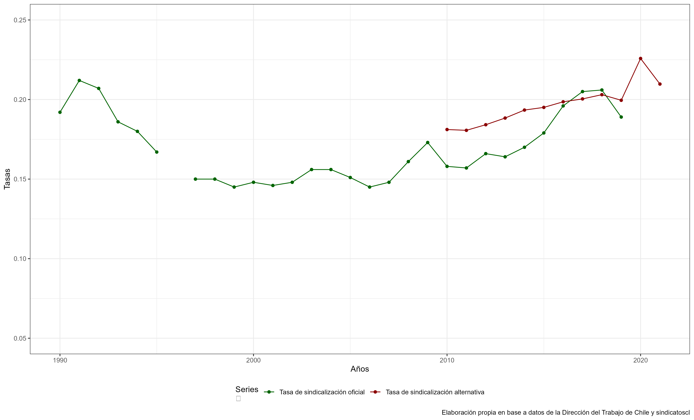

```{r, include = FALSE}
knitr::opts_chunk$set(
  collapse = TRUE,
  comment = "#>"
)
```

```{r setup, message=FALSE, warning=FALSE}
library(sindicatoscl)
library(tidyverse)
```

Con la función `tasa_sindicalizacion()` se puede acceder a dos conjuntos de series históricas de las tasas de sindicalización: (1) series oficiales publicada por la Dirección del Trabajo en sus compendios; y (2) serie no oficial calculada desde microdatos de este paquete.

Cada conjunto contiene 3 series. Las que se definen así:

metodologia1 = Población Afiliada / Total de ocupados*100

metodologia2 = Población Afiliada / Total de ocupados (excluye asalariados s.público)*100

metodologia3 = Población Afiliada (excluye afiliados independientes) / Total de ocupados

## Series oficiales tasa de sindicalización

Se tiene el dato desde 1990 hasta 2019.

```{r}
tasa_sindicalizacion("dt")
```

## Series no oficiales tasa de sindicalización

Se demoran en calcular. 

El dato se presenta solo para 2010 en adelante dado que en INE no hay series públicas de empleo con la distinción entre asalariados sector público y sector privado para el periodo previo. 

```{r}
tasas <-tasa_sindicalizacion(metodo="res") 
tasas %>% mutate_at(c(2:4), ~.*100)
```

## Comparación

Solo considerando metodología 3: Población Afiliada (excluye afiliados independientes) / Total de ocupados

```{r include=FALSE}
merge(tasa_sindicalizacion("dt"),tasas,all = TRUE) %>% 
  select(ano,tasa3,tasa_sind3) %>% 
  rename(sindicatoscl=tasa3,
         dt=tasa_sind3) %>% 
  mutate(dt=dt/100) %>% 
  pivot_longer(c(2:3)) %>% 
  ggplot(aes(x=as.numeric(ano),y=value,color=name)) + 
  geom_line() +
  geom_point() +
  scale_y_continuous(limits = c(0.05,0.25))+
  labs(caption = "Elaboración propia en base a datos de la Dirección del Trabajo de Chile y sindicatoscl",
        color = "Series\n",
       x="Años",
       y="Tasas") +
  theme_bw() +
  scale_color_manual(labels = c("Tasa de sindicalización oficial", 
                                "Tasa de sindicalización alternativa"),
                     values = c("darkgreen","darkred")) +
  theme(legend.position = "bottom")
```


```{r eval=FALSE, echo=FALSE}
ggsave(
  plot = last_plot(),
  filename = "figures/tasas.png",
  device = "png",
  dpi = "retina",
  units = "cm",
  width = 33,
  height = 20
)
```

```{r echo=FALSE, out.width="70%"}

```

